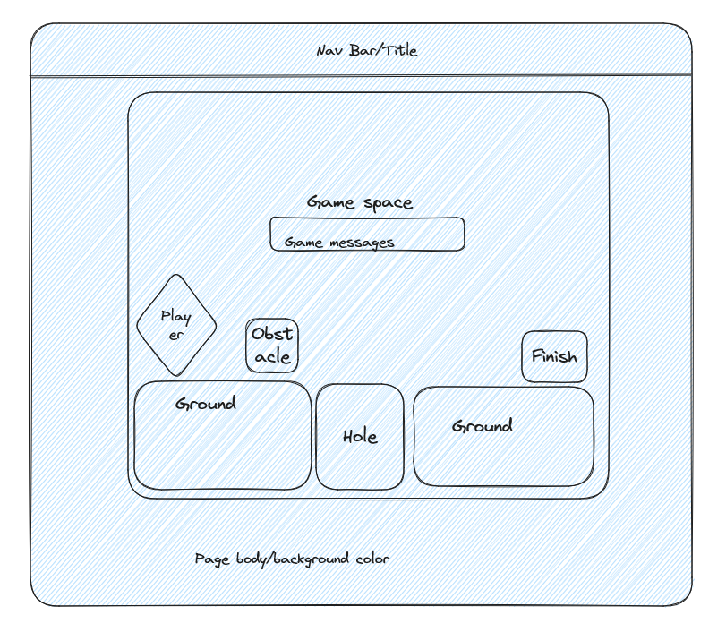

 # PROJECT 1 - URO'S JOURNEY
 ---

## Project Description

This project's aim was to practice the development tools learned in Unit 1 of the General Assembly Software Engineering Immersive program. The goal was to build a browser game that met the technical requiremeents below. I opted to create a 2d platform game, and to practice the basics of HTML, CSS, and JS, this needed to be done without the use of canvas elements. Building the collision logic, game loop, physics, and manipulating individual elements on screen was a really fun adventure.

## Technical Requirements - MVP
Your App Must:

☐ Render a game in the browser.

☐ Include win/loss logic and render win/loss messages in HTML. Popup alerts using the alert() method are okay during development, but not production.

☐ Include separate HTML, CSS & JavaScript files.

☐ Use vanilla JavaScript, not jQuery.

☐ Have properly indented HTML, CSS & JavaScript. In addition, vertical whitespace needs to be consistent.

☐ No remaining unused and/or commented out code (code that will never be called) .

☐ Have functions and variables that are named sensibly. Remember, functions are typically named as verbs and variables (data) named as nouns.

☐ Be coded in a consistent manner. For example, choose between your preference for function declarations vs. function expressions.

☐ Be deployed online using GitHub Pages so that the rest of the world can play your game!

---

## WIREFRAME

---

## INITIAL PSEUDOCODE

- define variables
- initialize home screen
- button with event listener to start the Game
- animate player, ground, obstacles, holes, and finish line using the DOM
- create gravity logic
- create object collision logic
- update win/loss/playing status based on contact/noncontact with holes/finish line
- tie player movements to keys
- update on screen messages based on game state
- create hidden play again button

EXTRAS
- Scroll to next page of level (no canvas, only DOM!)
- character jump/walk/direction animations
- death/win animations */

---

## USER STORIES

- User will be able to move character through the environment.
- User will be able to land on top of obstacles.
- User will lose the game when their character falls in a hole.
- User will win the game when their character enters the home.
- User will be able to interact with a home screen.
- User will be able to turn music on and off.
- User will be able to replay the level once it is completed/lost. 

---

## CREDITS

Gravity logic by Martin Heinz: https://towardsdatascience.com/implementing-2d-physics-in-javascript-860a7b152785 (My usage is EXTREMLY simplified)

Collision logic based on the code provided by Àlex Garcés on stack overflow: https://stackoverflow.com/questions/2440377/javascript-collision-detection

Movement logic based on code provided by Mark Lassoff: https://www.youtube.com/watch?v=Pg1UqzZ5NQM